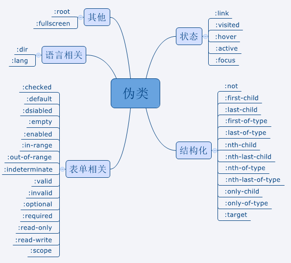

### CSS

#### 概念
CSS (Cascading Style Sheets)，即 层叠样式表  
层叠的意思是指 对一个元素多次设置同一个样式，将使用最后一次(优先级高的)样式

#### 选择器
页面中元素其实都可以看成是一个又一个的小盒子，我们可以通过 CSS 给盒子加上不同的样式，这个时候，有什么能帮我们可以快速的找到我们想加样式盒子，而使用的就是 **CSS 选择器**

##### 哪些样式可以被继承？
可继承的样式： font-size、color等   
不可继承的样式： width、height、border、padding、margin等

##### 分类
* 基本选择器
  * #id
  * .class
  * 通用(*) 
  * 元素(标签，element)
* 组合选择器
  * 多元素选择器
  * 后代选择器
  * 子元素选择器
  * 直接相邻子元素
  * 普通相邻子元素
* 属性选择器
  * [prop] 选择所有带 prop 属性的元素
  * [prop=val] 选择所有 props=val 的元素
  * [props=正则] 选择所有属性值 满足正则条件的元素
* 伪类选择器
  * :link 选择所有未访问过的链接
  * :visited 选择所有访问过的链接
  * :hover 鼠标悬浮
  * :active 当前正在活动的元素
  * :focus 选择元素输入后具有焦点
* 伪元素选择器
  ::before/:before  在被选元素前插入内容
  ::after/:after 在被选元素后插入内容

##### 伪类/伪元素
CSS 引入伪类和伪元素的概念是为了格式化文档树以外的信息。也就是说，伪类和伪元素是用来修饰不在文档树中的部分，比如，一句话中的第一个字母，或者是列表中的第一个元素  
  
有个总结的比较好的 [传送门](https://segmentfault.com/a/1190000013737796)


##### 优先级
`import > 内联样式 > #id > .class = 属性 > tag = 伪元素 > * > 继承 > 默认`  
当权重相同时，应用 **就近原则**  

##### 浏览器读取选择器 
浏览器读取选择器，遵循的原则是从选择器的 **右边到左边** 读取  
因此，选择器的最右边部分也被称为 关键选择器(keyselector)，它决定了选择器的效率  
```html
<style>
  div#box p span.red { color: red; }
</style>

浏览器读取选择的顺序如下：
  1、查找页面中所有 class=red 的 span 元素
  2、查找 1 结果的父元素中 p 元素
  3、查找 2 结果的父元素中 id=box 的 div 元素
```
!> 为什么这么做？这么做的好处是什么？  
**尽早过滤掉无关的样式规则，尽早的匹配到目标元素**


##### 选择器性能优化
```css
/* 1、避免使用通用选择器 */
.content * { ... }

/* 2、不要将 id 选择器最为关键选择器和其他选择器混合使用 */
.btns #btnIcon { ... }

/* 3、不要使用 class 时用标签名*/
div.content { ... } // bad
.div-content { ... } // good

/* 4、把多层标签选择器替换成 class，减少 css 查找 */
div[prop="btn"] > span > i { ... } // bad
.div-btn-span-i { ... } // good

/* 5、避免使用 子选择器 (后代选择器在 css 中是最昂贵的选择器) */
div span > i { ... }  // bad
.div-span-i { ... } // good

/* 6、依靠继承 */

/* 7、避免单属性选择器 */

/* 8、避免正则属性选择器 */

/* 9、移除无匹配的样式 （减小体积，减小索引项，加快浏览器查找速度） */
```
编写css时，优先使用 class 选择器，避免使用通用选择(*)，属性选择器；  
使用 id 选择器性能最好，但是要注意 **唯一性**


#### 盒模型(BFC)  
[传送门](/interview/examination/box-model)


#### 动画

##### transition
在 CSS3 引入 `transition`(过渡)这个概念之前，CSS 是没有时间轴的，意思是所有的状态变化都是及时完成的 
```css
  /* 此时，CSS 的动效及时完成的 */
  .box { width: 100px; height: 100px; background: #333333; }
  .box:hover { width: 200px; height: 200px; }

  /* 当加上 transition 后，才有过渡的效果，看起来是动画 */
  .box { transition: 1s; }

  /* 
     transition-property: height;
     transition-duration: 1s;
     transition-delay: 1s;
     transition-timing-function: ease;

    可简写成： transition: height 1s 1s ease; 
  */
```
###### transition 注意事项
1. 目前，各大浏览器（包括IE 10）都已经支持无前缀的transition，所以transition已经可以很安全地不加浏览器前缀
2. 不是所有的CSS属性都支持transition 
3. transition需要明确知道，开始状态和结束状态的具体数值，才能计算出中间状态。比如，height从0px变化到100px，transition可以算出中间状态。但是，transition没法算出0px到auto的中间状态，也就是说，如果开始或结束的设置是height: auto，那么就不会产生动画效果。类似的情况还有，display: none到block，background: url(foo.jpg)到url(bar.jpg)等等

###### transition的局限
transition 的优点在于简单易用，但是它有几个很大的局限。
1. transition 需要事件触发，所以没法在网页加载时自动发生。
2. transition 是一次性的，不能重复发生，除非一再触发。
3. transition 只能定义开始状态和结束状态，不能定义中间状态，也就是说只有两个状态。
4. 一条 transition 规则，只能定义一个属性的变化，不能涉及多个属性。

**<span class="red">CSS Animation就是为了解决这些问题而提出的</span>**


##### Animation
###### 基本用法
```css
  /* 1、指定动画一个周期持续的时间，以及动画效果的名称 */
  .box:hover { animation: 1s rainbow; }

  @keyframes rainbow {  
    0% { width: 100px }
    50% { width: 150px }
    100% { width: 200px }
  }

  /* 默认情况下，动画只播放一次。加入infinite关键字，可以让动画无限次播放 */
  /* 也可以指定动画具体播放的次数，比如 3 次 */
  .box { animation: 1s rainbow 3; }
```
###### 其他属性
    动画结束以后，会立即从结束状态跳回到起始状态。如果想让动画保持在结束状态，需要使用`animation-fill-mode`属性
    1. none：默认值，回到动画没开始时的状态
    2. backwards：让动画回到第一帧的状态
    3. both: 根据 animation-direction（见后）轮流应用forwards和backwards规则

    有时，动画播放过程中，会突然停止。这时，默认行为是跳回到动画的开始状态
    如果想让动画保持突然终止时的状态，就要使用animation-play-state属性

动画循环播放时，每次都是从结束状态跳回到起始状态，再开始播放。animation-direction属性，可以改变这种行为，兼容性不好，慎用！


[常见移动端布局方式](/blog/css/layout)

* style 与 import 哪个权重更高
* sass/less
  * 常见语法、相对css的增强功能
* em、rem、vh等
* vertical-align
* 纯 css 实现实心、带边框、空心三角
* 纯 css 实现 播放/暂停按钮
* 盒子相对父盒子居中的几种办法
* 一个div，怎么用css实现半圆和圆形
* display:none与visibility:hidden的区别
* div包裹 img，底部会出现空白
* 如何清除浮动？