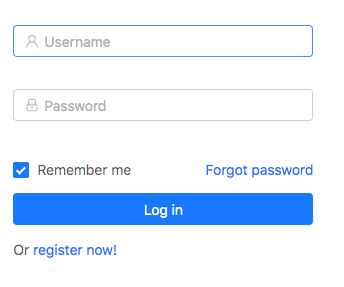
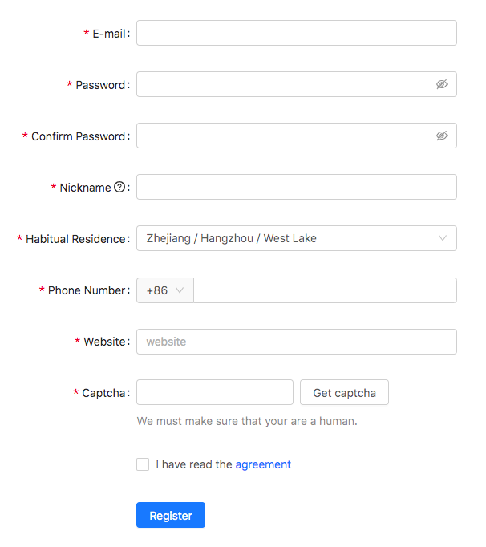
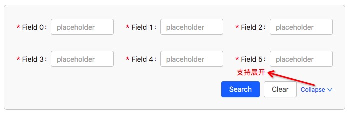

## 表单组件 Form
> 具有数据收集、校验和提交功能的表单，包含复选框、单选框、输入框、下拉选择框等元素。

### 应用场景
&emsp;&emsp;通常来说，一般我们有以下三个应用场景。

#### 登录框
&emsp;&emsp;普通的登录框，可以容纳更多的元素。  


#### 注册框
&emsp;&emsp;用户填写必须的信息，用以注册新用户或者编辑。


#### 高级搜索框
&emsp;&emsp;三列栅格式的表单排列方式，常用于数据表格的高级搜索。  
&emsp;&emsp;有部分定制的样式代码，由于输入标签长度不确定，需要根据具体情况自行调整。



### 使用
&emsp;&emsp;1、需要使用 **Form.create()** 的返回值 装饰自定义组件，包装过的组件会自带 **this.props.form** 属性。  
&emsp;&emsp;2、给 Form.Item 设置 **layout(整体)**、**labelCol(左侧表单名称)**、**wrapperCol(右侧表单控件)** 来控制表单的布局。   
&emsp;&emsp;3、通过 this.props.form 的 **getFieldDecorator** 方法，用于字段名称与表单项的绑定，同时可以设置表单的一些默认行为。  
&emsp;&emsp;&emsp;&emsp;默认行为有： 初始值、校验规则等。  
&emsp;&emsp;4、使用 this.props.form 的 **validateFieldsAndScroll** 方法，校验并获取一组输入域的值与 Error，参数格式为 **([fieldNames: string[]], options: object], callback(errors, values)) => void**，若 fieldNames 参数为空，则校验全部组件。  
```javascript
import React, { Component } from 'react'
import { inject, observer } from 'mobx-react'
import { Modal, Form, Input, Select, message } from 'antd'

// url 验证
const URL_REG = /(http|ftp|https):\/\/[\w\-_]+(\.[\w\-_]+)+([\w\-.,@?^=%&:/~+#]*[\w\-@?^=%&/~+#])?/

// 通过 mobx 注入 app props
@inject('app')
@observer
class ActivityForm extends Component {

  submit () {
    const { app, form: { validateFieldsAndScroll } } = this.props
    // 校验 并 获取表单中值
    validateFieldsAndScroll((err, values) => {
      if (!err) {
        const { update } = this.props
        if (!app.commodityImgUrl) { // 清除了图片
          return message.error('商品图片为必填项！')
        }
        const params = {
          ...values,
          commodityImgUrl: app.commodityImgUrl
        }
        // 如果是编辑，保存时需要将 id 加上
        if (app.editCommodity.id !== '') {
          params.id = app.editCommodity.id
        }
        updateCommodity(params).then(data => {
          if (data.code === 0) { // 新增成功
            this.handleCatch()
            // 不刷新页面，但是重新调用商品列表接口
            update()
          }
        })
      }
    })
  }

  cancel () { // 编辑商品取消
    this.handleCatch()
  }

  render(){
    const Option = Select.Option
    const { form: { getFieldDecorator } } = this.props

    const formItemLayout = {
      labelCol: { span: 6 },
      wrapperCol: { span: 14 }
    }

    return <Modal
      destroyOnClose
      title='新增商品'
      visible={true}
      onOk={this.submit}
      onCancel={this.cancel}
    >
      <Form {...formItemLayout}>
        <Form.Item label='商品名称'>{
          getFieldDecorator('commodityName', {
            initialValue: app.editCommodity.commodityName, // 默认值
            rules: [ // 校验规则
              { required: true, message: '必填' } // 必填
            ]
          })(
            <Input placeholder='字数限制20字' />
          )
        }</Form.Item>
        <Form.Item label='市面价值'>{
          getFieldDecorator('marketPrice', {
            initialValue: app.editCommodity.marketPrice,
            rules: [
              { pattern: /^[0-9|.]+$/g, message: '请输入数字' } // 正则校验
            ]
          })(
            <Input placeholder='输入商品实际金额（数字）即可' />
          )
        }</Form.Item>
        <Form.Item label='兑换价格'>{
          getFieldDecorator('exchangePrice', {
            initialValue: app.editCommodity.exchangePrice,
            rules: [
              { required: true, message: '必填' },
              { pattern: /^[0-9]+$/g, message: '请输入数字' }
            ]
          })(
            <Input placeholder='输入积分数字即可（非负数）' />
          )
        }</Form.Item>
        <Form.Item label='商品链接'>{
          getFieldDecorator('commodityUrl', {
            initialValue: app.editCommodity.commodityUrl,
            rules: [
              { required: true, message: '必填' },
              { pattern: URL_REG, message: '请输入合法链接' }
            ]
          })(
            <Input placeholder='请输入合法链接，该链接跳转商品详情页面' />
          )
        }</Form.Item>
        <PriceUpload id='commodityImgUrl' label='商品图片' getFieldDecorator={getFieldDecorator} onchange={this.setState.bind(this)} />
        <Form.Item label='商品角标'>{
          getFieldDecorator('cornerId', {
            initialValue: cornerInit
          })(
            <Select style={{ width: '30%' }}>{
              cornerList.map((corner, index) => <Option key={index} value={corner.id}>{corner.name}</Option>)
            }</Select>
          )
        }</Form.Item>
      </Form>
    </Modal>
  }
}

// 增强自定义组件，在 props 中会增加 form 属性
export default Form.create()(ActivityForm)
```


<p align="right"> 2019年11月26日 </p>

[1]:https://ant.design/docs/react/introduce-cn
